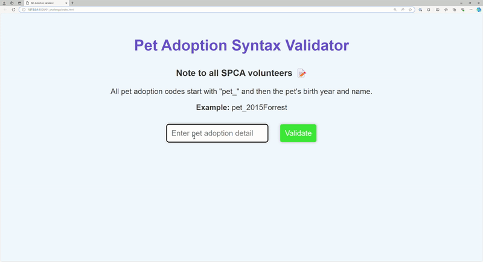

# Syntax-Engine Interaction

**Brief:**

This is virtual pet adoption website with a JavaScript function that checks if the user has entered valid pet adoption details. This function takes a string as input and validates if it follows a specific syntax, such as starting with "pet_" followed by a combination of letters and numbers. If the input follows the syntax, return "Valid Syntax," otherwise, return "Invalid Syntax."

Practice challenges on Scrimba : https://scrimba.com/playlist/pqPae6ZH7